# Claude Context Mind Map

Generated: 2026-07-05T16:49:22.064Z
Schema: shibanshu.context.v1
Profile: analysis (Analysis)
Fingerprint: 2eb2e578c15b3dd8c9988589
Root: /Users/shibanshujha/Documents/markdown-viewer-mac
Files indexed: 175
Resolved links: 4
Unresolved links: 2
Limits: max 5000 files, max 768000 bytes per file, max depth 24

## Mermaid Mind Map

```mermaid
mindmap
  root((markdown-viewer-mac))
    High Signal Files
      src/renderer.js
        Tasks
        Notes
        Goals
        Log
      scripts/stress-check.mjs
      skills/shibanshu-markdown-context/references/workflows.md
        Shibanshu Markdown Viewer Workflows
        Output Files
        Common Commands
        LLM Prompt Patterns
      skills/shibanshu-markdown-context/SKILL.md
        Shibanshu Markdown Context
        MCP Server Recommended
        Available MCP Tools
        Scene and 3D Payload
      src/capacitor-bridge.js
      src/index.html
      src/styles.css
    LLM Navigation Routes
      Orientation Route
        packages/mcp-server/README.md
        README.md
        src/renderer.js
        scripts/stress-check.mjs
        skills/shibanshu-markdown-context/references/workflows.md
        skills/shibanshu-markdown-context/SKILL.md
      Graph Hubs And Bridges Route
        src/renderer.js
        scripts/stress-check.mjs
        skills/shibanshu-markdown-context/references/workflows.md
        skills/shibanshu-markdown-context/SKILL.md
        src/capacitor-bridge.js
        src/index.html
      Implementation Route
        src/renderer.js
        electron/main.cjs
        mcp-server.mjs
        packages/mcp-server/mcp-server.mjs
        scripts/stress-check.mjs
        scripts/publish-static-site.mjs
      Symbol And Import Route
        electron/main.cjs
        mcp-server.mjs
        packages/mcp-server/export-context.mjs
        packages/mcp-server/mcp-server.mjs
        scripts/export-claude-map.mjs
        scripts/generate-app-icon.mjs
      Risk And Cleanup Route
        scripts/stress-check.mjs
        src/renderer.js
        package-lock.json
        android/app/src/main/assets/public/assets/katex-CddkPoXu.js
        android/app/src/main/assets/public/assets/cytoscape.esm-B3I8pqwA.js
        android/app/src/main/assets/public/assets/chunk-KEIR6QF5-BfrZ3jm6.js
    Code Imports
      scripts/stress-check.mjs - src/index.html
      src/renderer.js - src/capacitor-bridge.js
      src/renderer.js - src/styles.css
    Symbols
      electron/main.cjs
        variable - fs
        variable - fsp
        variable - crypto
        variable - path
      mcp-server.mjs
        variable - execFileAsync
        variable - dirname
        variable - CLI PATH
        variable - EXPORT SCRIPT
      packages/mcp-server/export-context.mjs
        variable - MARKDOWN EXTENSIONS
        variable - CODE EXTENSIONS
        variable - IGNORED DIRECTORIES
        variable - DEFAULT MAX FILES
      packages/mcp-server/mcp-server.mjs
        variable - execFileAsync
        variable - dirname
        variable - CLI PATH
        variable - EXPORT SCRIPT
      scripts/export-claude-map.mjs
        variable - MARKDOWN EXTENSIONS
        variable - CODE EXTENSIONS
        variable - IGNORED DIRECTORIES
        variable - DEFAULT MAX FILES
      scripts/generate-app-icon.mjs
        variable - root
        variable - buildDir
        variable - iconsetDir
        variable - baseIconPath
      scripts/publish-static-site.mjs
        variable - MARKDOWN EXTENSIONS
        variable - IGNORED DIRECTORIES
        variable - DEFAULT MAX FILES
        variable - DEFAULT MAX BYTES
      src/renderer.js
        variable - native
        variable - SESSION KEY
        variable - THEME KEY
        variable - GRAPH PRESETS KEY
      scripts/verify-mac-app.mjs
        variable - root
        variable - packageJson
        variable - productName
        variable - version
      scripts/browser-ui-smoke.mjs
        variable - root
        variable - appUrl
        variable - sessionKey
        variable - vaultRoot
      bin/shibanshu-markdown.mjs
        variable - root
        variable - scheme
        variable - maxUrlContentBytes
        variable - args
      src/capacitor-bridge.js
        variable - AUTOSAVE KEY
        variable - RECENT ITEMS KEY
        variable - MAX VAULT FILES
        variable - MAX VAULT DEPTH
      scripts/release-readiness.mjs
        variable - root
        variable - releaseDir
        variable - packageJson
        variable - productName
      scripts/smoke-check.mjs
        variable - root
        variable - requiredFiles
        variable - html
        variable - mainProcess
      scripts/stress-check.mjs
        variable - root
        variable - tempRoot
        variable - vaultDir
        variable - contextDir
      scripts/diagnose-mac-launch.mjs
        variable - diagnosticDir
        variable - sinceMinutes
        variable - requireClean
        variable - maxReports
      scripts/e2e-electron.mjs
        variable - root
        variable - tempDir
        variable - userDataDir
        variable - testFile
      scripts/generate-download-page.mjs
        variable - root
        variable - packageJson
        variable - releaseManifestPath
        variable - releaseReadinessPath
    Clusters
      android - 109 files
        android/app/src/main/assets/public/assets/katex-CddkPoXu.js
        android/app/src/main/assets/public/assets/cytoscape.esm-B3I8pqwA.js
        android/app/src/main/assets/public/assets/chunk-KEIR6QF5-BfrZ3jm6.js
      docs - 22 files
        docs/marketing/ads/explorer-v4.html
        docs/marketing/ads/explorer-resourceai.html
        docs/marketing/ads/explorer-v2.html
      scripts - 18 files
        scripts/stress-check.mjs
        scripts/export-claude-map.mjs
        scripts/smoke-check.mjs
      / - 10 files
        package-lock.json
        mcp-server.mjs
        index.html
      packages - 5 files
        packages/mcp-server/export-context.mjs
        packages/mcp-server/mcp-server.mjs
        packages/mcp-server/package-lock.json
      src - 5 files
        src/renderer.js
        src/styles.css
        src/index.html
      skills - 3 files
        skills/shibanshu-markdown-context/SKILL.md
        skills/shibanshu-markdown-context/references/workflows.md
        skills/shibanshu-markdown-context/agents/openai.yaml
      electron - 2 files
        electron/main.cjs
        electron/preload.cjs
      bin - 1 files
        bin/shibanshu-markdown.mjs
    Folders
      / — 10 files
      android/app/src/main/assets — 2 files
      android/app/src/main/assets/public — 3 files
      android/app/src/main/assets/public/assets — 104 files
      bin — 1 file
      docs — 9 files
      docs/download — 1 file
      docs/marketing — 3 files
      docs/marketing/ads — 9 files
      electron — 2 files
      packages/mcp-server — 5 files
      scripts — 18 files
      skills/shibanshu-markdown-context — 1 file
      skills/shibanshu-markdown-context/agents — 1 file
      skills/shibanshu-markdown-context/references — 1 file
      src — 5 files
    Tags
      #tags - 1
    Link Hubs
      src/renderer.js - 2 links
      scripts/stress-check.mjs - 1 links
      skills/shibanshu-markdown-context/references/workflows.md - 1 links
      skills/shibanshu-markdown-context/SKILL.md - 1 links
      src/capacitor-bridge.js - 1 links
      src/index.html - 1 links
      src/styles.css - 1 links
    Unresolved Links
      scripts/stress-check.mjs to ./alpha
      src/renderer.js to ./sample.md?raw
```

## Claude Prompts

- Use the Mermaid mind map above to explain this repo or vault as a system.
- Identify weakly connected files and suggest missing links or docs.
- Propose a better folder/topic map, citing source paths from this file.
- Convert the map into an implementation plan with risks and test targets.

## Source Nodes

- src/renderer.js: 11688 words, 9429 lines, 4 headings
- scripts/stress-check.mjs: 1971 words, 341 lines, 0 headings
- skills/shibanshu-markdown-context/references/workflows.md: 301 words, 77 lines, 6 headings
- skills/shibanshu-markdown-context/SKILL.md: 663 words, 113 lines, 9 headings
- src/capacitor-bridge.js: 1547 words, 453 lines, 0 headings
- src/index.html: 3290 words, 665 lines, 0 headings
- src/styles.css: 8510 words, 3163 lines, 0 headings
